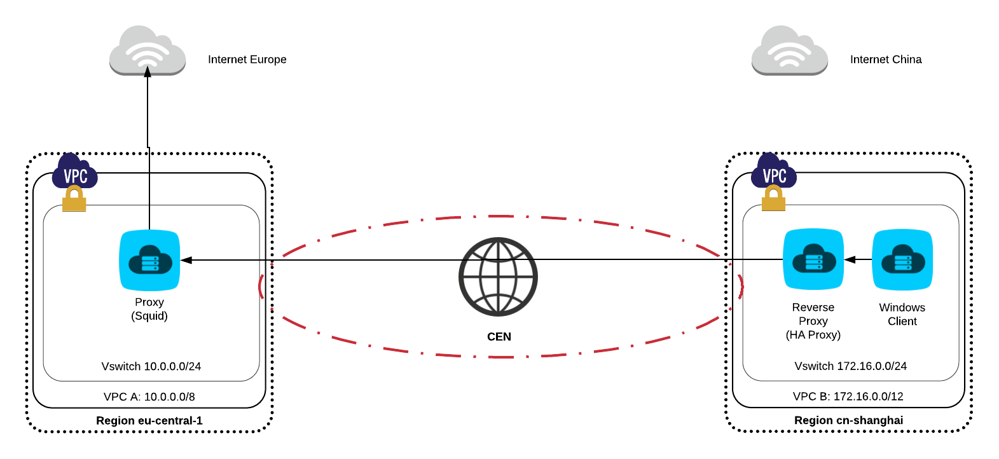

>Github [https://github.com/3dw1np/alicloud-cen](https://github.com/3dw1np/alicloud-cen)

# Alibaba (CEN) - Intranet China to Internet Europe - User Case #1

At Alibaba Cloud, we use Terraform to provide fast demos to our customers.
I truly believe that the infrasture-as-code is the quick way to leverage a public cloud provider services. Instead of clicking on the Web Console UI, the logic of the infrasture-as-code allows us to define more accuratly each used services, automate the entire infrastructure and version it with a versionning control (git).

## High-level design



## Export environment variables
We provide the Alicloud credentials with envrionments variables. In this tutorial, we are going to use the Singapore Region (ap-southeast-1).
 
```
root@alicloud:~$ export ALICLOUD_ACCESS_KEY="anaccesskey"
root@alicloud:~$ export ALICLOUD_SECRET_KEY="asecretkey"
root@alicloud:~$ export ALICLOUD_REGION="eu-central-1"
```

If you don't have an access key for your Alicloud account yet, just follow this [tutorial](https://www.alibabacloud.com/help/doc-detail/28955.htm).

## Install Terraform
To install Terraform, download the appropriate package for your OS. The download contains an executable file that you can add in your global PATH.

Verify your PATH configuration by typing the terraform

```
root@alicloud:~$ terraform
Usage: terraform [--version] [--help] <command> [args]
```

## Setup Alicloud terraform provider (> v1.19.0)
The official repository for Alicloud terraform provider is [https://github.com/alibaba/terraform-provider]() 

* Download a compiled binary from https://github.com/alibaba/terraform-provider/releases.
* Create a custom plugin directory named **terraform.d/plugins/darwin_amd64**.
* Move the binary inside this custom plugin directory.
* Create **test.tf** file for the plan and provide inside:

```
# Configure the Alicloud Provider
provider "alicloud" {}
```

* Initialize the working directory but Terraform will not download the alicloud provider plugin from internet, because we provide a newest version locally.

```
terraform init
```

## Deployment steps

### Paramaters file
In the file parameters/global_network.tfvars, you can change the default configuration of the project. The vpcs will be created in region eu-central-1 and cn-shanghai.

```
name = "global_cen"

region_id_A = "eu-central-1"
cidr_A = "10.0.0.0/8"
az_count_A = 1

region_id_B = "cn-shanghai"
cidr_B = "172.16.0.0/12"
az_count_B = 1

bandwidth = 2

```

### Launch the stack
```bash
terraform init solutions/global_network
terraform plan|apply|destroy \
  -var-file=parameters/global_network.tfvars \
  -state=states/global_network \
  solutions/global_network
```

### Terraform modules description

#### vpc
Create a vpc in a specific region.

#### cen
Create a CEN instance in a speific region, then it attach all VPC childs and also order/bind a bandwidth package between China <-> Europe (of 2 Mbps by default).

#### ecs\_reverse\_proxy
Create a ECS in a specific Vswitch with all security groups nested and bootstrap a pre-configured *HAproxy*.

#### ecs\_proxy
Create a ECS in a specific Vswitch with all security groups nested and bootstrap a pre-configured *Squid*.

### Run a new instance Windows with the ECS wizard
Follow the different steps and make sure you select the right VPC (where the reverse proxy is running).

[https://www.alibabacloud.com/help/doc-detail/87190.htm]()

Finally, install Chrome and setup the proxy with the IP address of the reverse proxy and the port (80 by default).

[https://customers.trustedproxies.com/knowledgebase.php?action=displayarticle&id=10]()
 

### Debug

##### Useful command Tcpdump for sniffering http request
[http://www.music-come.com/2015/06/09/tcpdump-http-request/]()